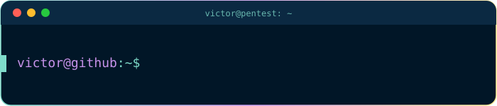

  

  

<h3 align="center">Full Stack Developer · Cybersecurity Enthusiast</h3>

Python · Lua · Node.js · React · Automação · Zabbix / Grafana

💻 Portfólio: <a href="https://hakor.vercel.app/">hakor.vercel.app</a>

 

## ~/stack

  

## ~/metrics

Gerado por GitHub Actions e commitado direto neste repositório — sem depender de serviço externo, então não fica sujeito a "deployment paused".

  

  

## ~/contributions

<picture>
  <source media="(prefers-color-scheme: dark)" srcset="https://raw.githubusercontent.com/victorcarmo2003/victorcarmo2003/output/dist/snake-dark.svg" />
  <source media="(prefers-color-scheme: light)" srcset="https://raw.githubusercontent.com/victorcarmo2003/victorcarmo2003/output/dist/snake.svg" />
  
</picture>

## ~/connect

  
  
  

 

<code>victor@github:~$ exit</code>

